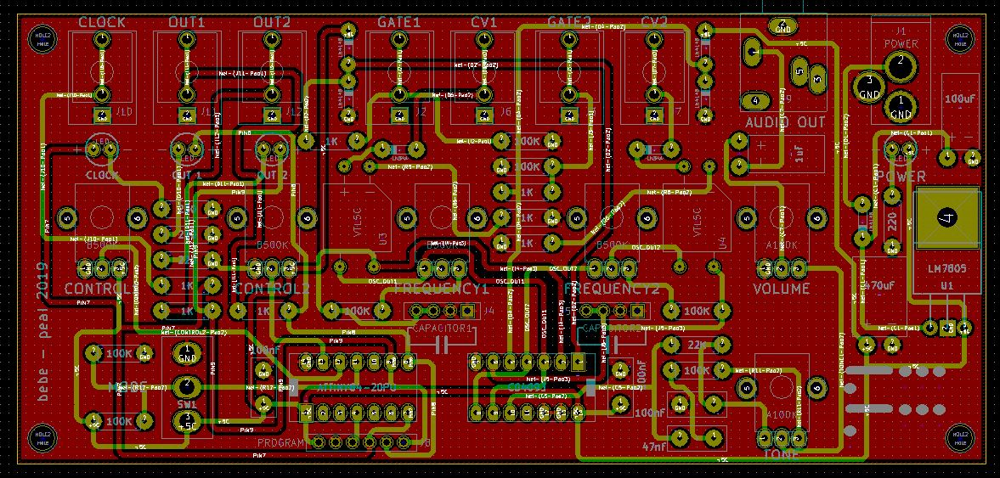

# bebe

The name is a tribute to Bebe Barron, pioneer in the field of electronic music.

- 5 steps euclidean gate sequencer/square LFO based on ATtiny84 with 2 gates and a clock output  

- two frequency mixed lunetta style NAND oscillators with gate and CV control (with vactrol)

- volume and tone control inspired by big muff pi tone section

In this repository you can find the schematic, the PCB production files and the software to build your own device.

Enjoy.
